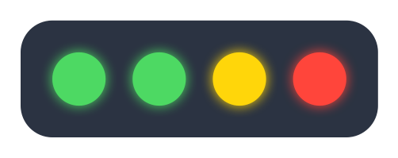
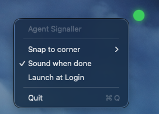

# 🚦 agent-signaller

**An always-visible traffic light for your AI coding agents.**

Stop checking every terminal to see whether Claude Code or Codex has finished.
`agent-signaller` puts a tiny, always-on-top badge in a corner of your screen —
one dot per live session — so you can tell at a glance who's busy and who needs
you, from anywhere on any desktop.

- 🔴 **RED** — an agent is actively working
- 🟡 **YELLOW** — an agent is blocked, waiting for you (permission / input)
- 🟢 **GREEN** — finished / idle → your turn

**One dot per session**, in a row. **Click a dot to jump straight to its
terminal tab.**

<p align="center">
  
</p>

> **Float it anywhere.** Pin the badge to any corner of the screen, or grab it
> with the mouse and drag it wherever you want the signal to float — its position
> is remembered across launches.

---

## Why

Running several agents across several terminals means constantly tabbing around
to check "is it done yet?". `agent-signaller` answers that question without you
moving — a single glance at the corner of any screen.

- **Glance, don't hunt** — never alt-tab through terminals again.
- **Always visible, every Space** — floats on top across all desktops and
  screens. No Dock icon, no clutter.
- **One dot per session** — run five agents, see five states in a row.
- **Click to jump** — click a dot to focus its exact Terminal.app / iTerm2 tab.
- **Claude Code *and* Codex** — wired via each tool's official hooks.
- **Native & tiny** — pure Swift/AppKit, no dependencies, negligible CPU.
- **Local-only** — state is plain JSON under your home dir; nothing leaves your
  machine.

---

## Install

Requires macOS 13+ and the Xcode command-line tools (`swift`). Everything builds
from source — no signing/notarization needed.

### Homebrew (recommended)

```bash
brew install jasjah/agent-signaller/agent-signaller
```

Then finish setup (the formula prints these as caveats):

```bash
cp -R "$(brew --prefix)/opt/agent-signaller/AgentSignaller.app" /Applications/
agent-signaller install --bin "$(brew --prefix)/bin/agent-signaller"
open -a AgentSignaller
```

### One-line curl

```bash
curl -fsSL https://raw.githubusercontent.com/Jasjah/agent-signaller/main/install.sh | bash
```

### From a clone

```bash
git clone https://github.com/Jasjah/agent-signaller.git
cd agent-signaller
./scripts/install.sh
```

The curl / clone installers do everything in one go:

1. Build `AgentSignaller.app` and install it to `/Applications`.
2. Symlink the `agent-signaller` CLI onto your `PATH`.
3. Wire up Claude Code + Codex (backing up your configs first).
4. Launch the badge.

The badge appears in the bottom-right corner. Right-click it to pick a corner,
enable **Launch at Login**, or quit.

> **First click → Automation prompt.** The first time you click a dot, macOS asks
> to let AgentSignaller control Terminal — allow it so tab-focusing works.

### What gets configured

| Tool | File | Hooks |
|------|------|-------|
| Claude Code | `~/.claude/settings.json` | `UserPromptSubmit`→working, `Notification`/`PermissionRequest`→waiting, `Stop`→done, `SessionEnd`→clear |
| Codex | `~/.codex/config.toml` | `notify` → marks the session done on turn-complete |

Both files are backed up to `*.agent-signaller.bak` before editing.

> ℹ️ Claude Code loads settings at startup, so **open a new session** after
> installing for the hooks to take effect.

---

## Usage

- **Dots** read left-to-right, one per live session. Hover for a tooltip
  (`tool · state · project`).
- **Left-click a dot** → focus that session's terminal tab.
- **Drag** the badge to reposition (remembered across launches).
- **Resize** → grab the badge's **trailing edge** (the cursor turns into a
  resize arrow) and drag to scale all dots at once (12–40pt, remembered).
  "Reset dot size" in the menu snaps back to default.
- **Right-click** → snap-to-corner, reset dot size, toggle the completion
  sound, Launch at Login, Quit.

<p align="center">
  
</p>

A **chime plays when a session turns green** so you get an audible "done" even
when you're looking elsewhere. Toggle it any time via **Sound when done**.

Debug from the terminal:

```bash
agent-signaller status   # aggregate state + every live session
agent-signaller gc       # prune stale sessions
```

---

## How it works

```
 Claude Code hooks ─┐
                    ├─► agent-signaller CLI ─► ~/.agent-signaller/sessions/<id>.json
 Codex notify ──────┘                                      │ (polled ~0.4s)
                                                           ▼
                                          AgentSignaller.app (floating dots)
```

Each agent event runs the `agent-signaller` CLI, which writes a small JSON file
for that session (state + the terminal it runs in). The app polls the directory
and renders a dot per session. Stale sessions (>30 min) are pruned automatically.

---

## Limitations

- **Full-screen apps:** a floating window can't draw over *another app's* native
  full-screen Space (a macOS restriction). The badge shows on all normal Spaces.
- **Codex "working" (red):** Codex only emits an event when a turn *completes*,
  not when it starts — so Codex reliably drives the **green "done"** signal, while
  Claude Code drives the full red/yellow/green cycle.
- **Tab focusing** works for Terminal.app and iTerm2 (matched by `tty`); other
  terminals are simply activated.

---

## Uninstall

```bash
# restore backups, then:
rm -rf /Applications/AgentSignaller.app
rm -f "$(command -v agent-signaller)"
rm -rf ~/.agent-signaller
# restore ~/.claude/settings.json.agent-signaller.bak and remove the
# notify line from ~/.codex/config.toml
```

---

## Build only (no install)

```bash
./scripts/build-app.sh   # produces ./AgentSignaller.app
swift build              # debug build of the CLI + app binaries
```
